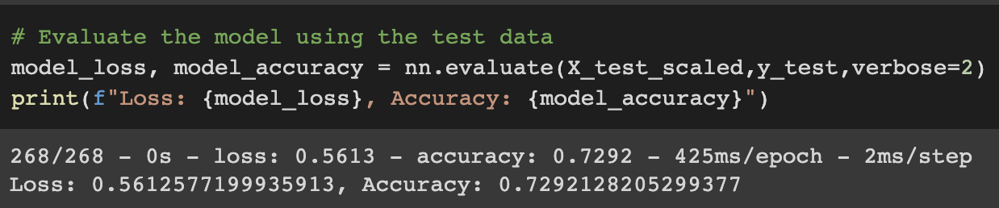
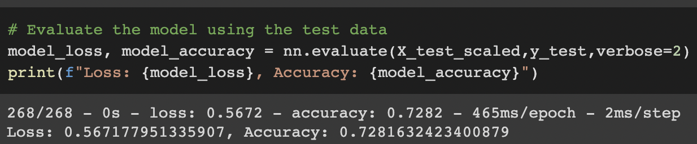
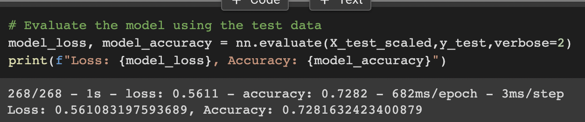
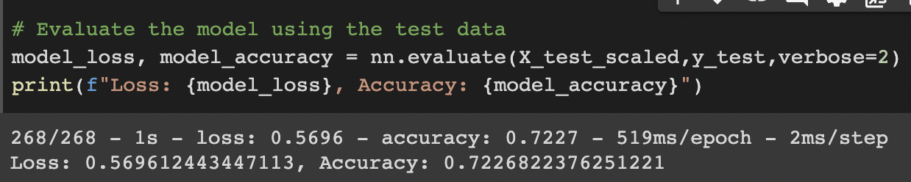

# neural_network_charity_analysis

An analysis in Neural Networks and Deep Learning Models to preprocess a  dataset and create a predictive binary classifier for successful charitable donations, using TensorFlow and Pandas libraries in Python. 

---

## Overview of the analysis: 

The purpose of this project was to use Deep Learning Neural Networks using TensorFlow and Pandas libraries in Python to preprocess a dataset and create a predictive binary classifier for  successful charitable donations. The following methods for analysis were used.

* Preprocessing, preparing the dataset for the neural network model.
* Create a training, testing set and evaluate the model for accuracy.
* Optimize the model, by adding additional neurons and hidden layers. 

---

## Resources:

Data Source: [charity_data.csv](resources/charity_data.csv)

Tools: Google Colabs, Python, TensorFlow, Pandas, Sklearn, Machine Learning, Deep Neural Network

---

## Results: 

To create a predictive binary classifier for successful charitable donations. The original dataset charity_data.csv file contains more than 34,000 organizations that have received funding from the  charitable foundation over the years. The dataset had several columns that capture metadata about each of the organization, including:
* EIN and NAME—Identification columns
* APPLICATION_TYPE—Alphabet Soup application type
* AFFILIATION—Affiliated sector of industry
* CLASSIFICATION—Government organization classification
* USE_CASE—Use case for funding
* ORGANIZATION—Organization type
* STATUS—Active status
* INCOME_AMT—Income classification
* SPECIAL_CONSIDERATIONS—Special consideration for application
* ASK_AMT—Funding amount requested
* IS_SUCCESSFUL—Was the money used effectively

### Data Preprocessing

* What variables are considered the targets for your model?
The IS_SUCCESSFUL column is considered as the target for the deep learning neural network model, as it contained binary data referring to whether the charity donation was used effectively or not.

* What variables are the features for your model?
The following columns were used as features for the model APPLICATION_TYPE, AFFILIATION, CLASSIFICATION, USE_CASE, ORGANIZATION, STATUS, INCOME_AMT, SPECIAL_CONSIDERATIONS, and ASK_AMT.
	
* What variables are neither targets nor features, and should be removed from the input data?
	The EIN and NAME columns were dropped during preprocessing as they added no value.

### Compiling, Training, and Evaluating the Model

* How many neurons, layers, and activation functions did you select for your neural network model, and why?
The original model had 5,981 total parameters, the result of 43 inputs with 2 hidden layers and 1 output layer. The first hidden layer had 43 inputs, 80 neurons and 80 bias terms. The seconded hidden layer had 80 inputs and 30 neurons and 30 bias terms. The output layer had 30 inputs, 1 neuron and 1 bias term. RELU or Rectified Linear Unit function was used to activate both the first and second hidden layers, the Sigmoid function was used to activate the output layer. 

* Were you able to achieve the target model performance?
	
The model only achieved an accuracy rate of 72.9%, under the target performance accuracy rate of 75%.

* What steps did you take to try and increase model performance?
	Three attempts were made to increase the model’s performance.

    * Optimization #1, the column INCOME_AMT was binned.
        The model only achieved an accuracy rate of 72.8%.
        

    * Optimization #2, the column INCOME_AMT and AFFILIATION was binned, and the column SPECIAL_CONSIDERATIONS_Y was removed from features. The neurons for the first hidden layer were increased to 100 and the second hidden layer was increased to 50 neurons.
        The model only achieved an accuracy rate of 72.8%.
        

    * Optimization #3, the column ORGANIZATION was removed and the INCOME_AMT column was binned.
        The model only achieved an accuracy rate of 72.2%.
        

---

## Summary:

The three different optimizations did not achieve the target performance accuracy rate of 75%, and none of the different optimizations matched the original model as shown in the results section. A different model such as a Random Forest Classifier could be used to compare against the deep learning model since it is a binary classification analysis. Random Forest Classifier is a supervised machine learning model, which would combine a multitude of decision trees to generate a classified output. 

---
